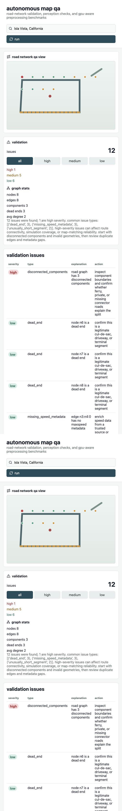

# autonomous map qa & perception simulation

this project is a software-only autonomous-systems qa tool for road-network validation, perception sample inspection, visual odometry experiments, and gpu-aware preprocessing benchmarks. it is designed around a complete local vertical slice: ingest a map, run deterministic validation checks, expose results through an api, and inspect them in a dashboard.

## motivation

autonomous systems depend on map and scene data that is consistent enough for routing, simulation, localization, and perception testing. small map defects can create broken routes, unrealistic simulation behavior, or confusing downstream debugging. this project provides a reusable foundation for finding those defects with open data and laptop-friendly tooling.

## architecture

- `backend/` contains the fastapi service, map ingestion, validation rules, perception checks, visual odometry, and gpu benchmark code.
- `frontend/` contains a vite/react dashboard for triggering the pipeline and inspecting issues.
- `scripts/` contains command-line entry points for ingestion, validation, sample-data generation, and benchmarks.
- `infra/` contains docker compose and kubernetes manifests for local deployment.
- `data/sample/` contains generated map and perception samples used when full public datasets are unavailable.

## map pipeline

the ingestion path accepts a place name such as `isla vista, california` or `santa clara, california`. when osmnx and network access are available, it can pull openstreetmap road graphs. when that is not practical, it falls back to a small generated road graph that intentionally includes real qa conditions: disconnected components, duplicate edges, dead ends, missing metadata, and a very short segment.

validation rules include:

- disconnected components
- isolated nodes and dead ends
- duplicate or near-duplicate edges
- missing or invalid geometry
- unusually short or long road segments
- missing road classification
- missing speed metadata
- one-way inconsistencies where detectable
- dead-end clusters
- low-connectivity subgraphs

each issue includes an id, type, severity, explanation, geometry or graph reference when available, and a recommended engineering action. validation results are written to postgres/postgis-compatible storage when `DATABASE_URL` and the driver are available. otherwise, results are saved as local json under `data/sample/generated_map/`.

## perception and visual odometry

the perception module loads a small kitti-style sample structure with image frames, timestamps, point-cloud-like binary files, and calibration metadata. it checks for missing frames, timestamp mismatches, empty point-cloud files, and invalid calibration fields.

the visual odometry module is slam-adjacent. it uses opencv orb features and descriptor matching to estimate frame-to-frame motion when opencv is installed. if camera intrinsics are available, it attempts essential-matrix pose recovery. this is not production slam; it is a lightweight qa tool for checking whether a driving-scene sequence is coherent enough for simulation experiments.

## gpu benchmark

the benchmark uses pytorch when available to run an image tensor normalization and reduction workload. cuda is optional. on cpu-only machines the benchmark still reports cpu timing, and when cuda exists it reports gpu timing and speedup. the goal is to demonstrate gpu-accelerated perception preprocessing concepts without requiring a gpu to run the project.

## run locally

create the sample perception data:

```bash
python scripts/generate_sample_data.py
```

start the backend:

```bash
cd backend
python -m venv .venv
source .venv/bin/activate
pip install -r requirements.txt
PYTHONPATH=. uvicorn app.main:app --reload --port 8000
```

start the frontend in another terminal:

```bash
cd frontend
npm install
npm run dev
```

open `http://localhost:5173`, run the pipeline, and inspect the validation table and panels.

## useful commands

run sample ingestion:

```bash
python scripts/run_ingestion.py --place "isla vista, california" --sample
```

run validation:

```bash
python scripts/run_validation.py
```

run the gpu/cpu benchmark:

```bash
python scripts/run_gpu_benchmark.py --size 512 --iterations 10
```

run tests:

```bash
PYTHONPATH=backend pytest backend/tests
```

## api endpoints

- `GET /health`
- `POST /maps/ingest`
- `POST /maps/validate`
- `GET /maps/issues`
- `GET /maps/summary`
- `GET /maps/graph-stats`
- `POST /perception/load-sample`
- `POST /perception/visual-odometry`
- `POST /benchmarks/gpu`
- `GET /benchmarks/latest`

## docker compose

```bash
docker compose -f infra/docker-compose.yml up --build
```

the backend is available on `http://localhost:8000` and the frontend on `http://localhost:5173`.

## kubernetes

build local images:

```bash
docker build -t map-qa-backend:local -f backend/Dockerfile .
docker build -t map-qa-frontend:local -f frontend/Dockerfile .
```

with kind:

```bash
kind load docker-image map-qa-backend:local
kind load docker-image map-qa-frontend:local
kubectl apply -f infra/k8s
kubectl port-forward service/map-qa-backend 8000:8000
```

the frontend service is exposed through nodeport `30080` for local clusters that support it.

## expected dashboard output

after running the default sample pipeline, the dashboard should show a road-network qa view, issue overlays, high/medium/low issue counts, graph statistics, a validation issue table, a perception sample status panel, and a benchmark panel. exact issue counts can change as validation rules evolve, but the sample data should always produce reproducible issues.



## engineering notes

openstreetmap and osmnx are used because they provide accessible real road-network data without requiring private autonomous vehicle map assets. graph validation matters because routing, map matching, and scenario simulation all depend on connected and correctly attributed road networks.

visual odometry is included because perception and simulation qa often needs a simple way to inspect whether frames, timestamps, calibration, and motion are internally coherent. gpu acceleration is optional because the project should run on normal laptops while still showing how perception preprocessing workloads can benefit from cuda.

kubernetes is included because backend, frontend, and spatial database services are commonly deployed as separate services in robotics and ai infrastructure environments. the manifests are intentionally small but coherent enough for kind or minikube.

the largest limitation is dataset realism. public openstreetmap data and generated kitti-style samples are useful for development, but production autonomous systems need richer lane semantics, sensor calibration, recorded logs, map versioning, and ground-truth validation data.

## future work

- add richer postgis queries for spatial filtering and issue history.
- support uploaded osm pbf, geopackage, and geojson files.
- add deck.gl or mapbox rendering for real geospatial layers.
- add lane-level validation rules and turn-restriction checks.
- add full kitti or nuscenes loaders with dataset manifests.
- store benchmark history and compare runs over time.
- add authentication and per-project map workspaces.
